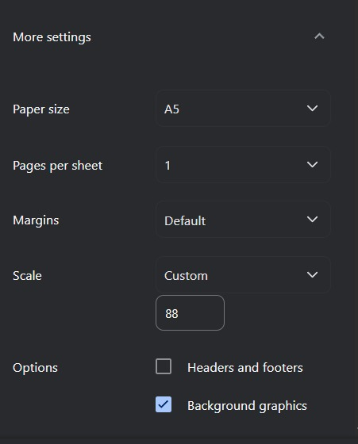

# Skrip Cetak KHS Otomatis (AIS Unmul)

Skrip ini dibuat untuk memudahkan mahasiswa dalam mencetak **Kartu Hasil Studi (KHS)** dari portal AIS Universitas Mulawarman secara otomatis. Dengan skrip ini, data KHS diambil langsung dari portal, diformat, dan dihasilkan dalam dokumen yang siap dicetak atau disimpan sebagai PDF.

# Video Tutorial (Coming Soon)

## Fitur Utama
- **Otomatisasi**: Mengambil data KHS langsung dari halaman AIS dan memformatnya secara otomatis.
- **Versi Cetak**: Menghasilkan KHS dalam format rapi, siap cetak, atau disimpan sebagai PDF.
- **Multi KHS**: Bisa mencetak 1 semester, rentang semester, semua semester, atau beberapa semester pilihan dalam 1 tab cetak.

## Catatan Penting
- **Bisa Digunakan Semua Fakultas**: Skrip ini sekarang sudah dapat digunakan untuk seluruh fakultas di portal AIS Unmul. Format KHS akan menyesuaikan dengan data dari masing-masing fakultas.
- **Pembaruan Berkelanjutan**: Skrip ini masih dalam pengembangan. Pantau pembaruan untuk fitur tambahan atau peningkatan kompatibilitas.

## Requirements
- Browser (Google Chrome, Microsoft Edge, atau semacamnya).
- Akses ke portal AIS Universitas Mulawarman ( [AIS Unmul](https://ais.unmul.ac.id) ).
- Pop-up harus diizinkan di browser untuk membuka tab baru saat mencetak.

## Cara Pakai (Update)
Ikuti langkah-langkah berikut untuk menggunakan skrip ini:

1. **Buka Halaman KHS di AIS**
   - Login ke [AIS Unmul](https://ais.unmul.ac.id/mahasiswa/khs).
   - Pastikan Anda berada di halaman KHS.

2. **Buka Console Developer**
   - Tekan `F12` atau klik kanan > **Inspect** > tab **Console**.

3. **Salin dan Tempel Skrip**
   - Salin kode dari file [`cetak khs`](cetak_khs.js).
   - Tempelkan ke tab **Console** di browser.

4. **Jalankan Skrip**
   - Tekan `Enter` setelah menempelkan kode.
   - Pilih mode KHS yang ingin diproses:
     - `1` untuk 1 semester saja.
     - `2` untuk rentang semester, contoh `2-5`.
     - `3` untuk semua semester.
     - `4` untuk beberapa semester pilihan, contoh `1,3,5` atau `1,3-5`.

5. **Pilih Mode Cetak**
   - Untuk mode `1`, tekan **OK** jika ingin membuat versi cetak KHS, atau **Batal** jika hanya ingin melihat detail KHS di halaman AIS.
   - Untuk mode `2`, `3`, dan `4`, skrip akan membuat semua KHS yang dipilih dalam 1 tab cetak.

6. **Isi Data**
   - Jika memilih versi cetak, masukkan data berikut saat diminta:
     - Nama Lengkap
     - NIM
     - Program Studi
     - Nama Fakultas
     - Nama Beasiswa (jika ada, atau kosongkan)
     - Nama Wakil Dekan
     - NIP Wakil Dekan

7. **Konfigurasi Cetak**
   - Tab baru akan terbuka dengan tampilan KHS siap cetak.
   - Atur settingan cetak browser sesuai instruksi (A5, Portrait, Scale 88, dll).
   - Contoh settingan cetak:  
     

8. **Cetak atau Simpan**
   - Tekan **Save** untuk PDF atau **Print** untuk mencetak langsung.

## Contoh Hasil Cetak
Berikut adalah tampilan KHS yang dihasilkan oleh skrip:  

